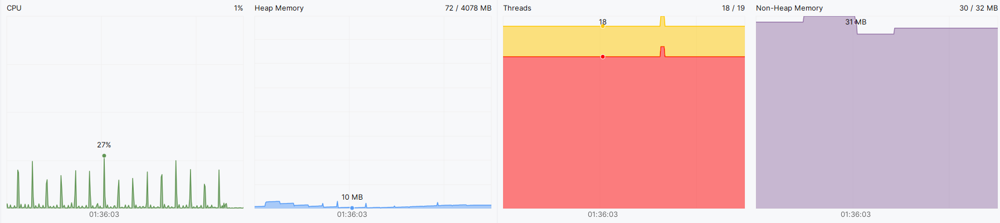
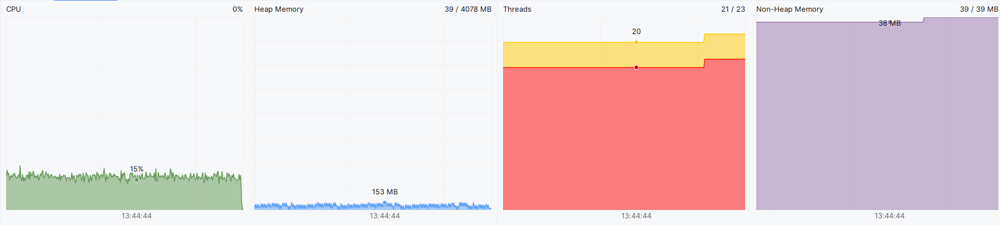

# Nem-funkcionális jellemzők vizsgálata

## Teljesítmény:

Az intellij-ben beépített Profiler segítségével megvizsgáltuk a memória és a CPU kihasználtságát. Legfőbbképpen a CPU, a Heap Memory, a Threads és a Non-Heap Memory komponenseket elemeztük 30 percen át, pontosabban egy új játék indításakor és a játékot tétlenül hagytuk. Az egyes komponensek időbeli kihasználtságát egy-egy vonaldiagramban vannak ábrázolva:

**CPU**: 

A tétlen állapotban hagyott játék szinte nem igényelt sok CPU-t. A játék megnyitására szükség volt kb. 40%-nyi CPU , de az idő többi részében mindvégig 0% körül mozgott. A játék tehát jól kezeli a tétlen állapotot hiszen emberi interakciók nélkül nem követel jelentős CPU erőforrást, amely a program müködése szempontjából elvárt. 

**Heap Memory**: 

A iddle állapotú játék a kezdetben 121 MB-nyi memóriát fogalt, majd 20 perc elteltével 187 MB-ot foglalt azaz további 66 MB-ra volt szükség. 187 Mb után a GC felszabadított 146 MB-ot, így 41 Mb-nyi memórát foglalt a program, amely egy kis idő elteltével elkezd újra nőni. A programban feltehetően nincs memóriaszivárgás és a GC nem használt memóriákat jól fel tudja szabadítani.

**Threads**: 

A program futása során 18 szálat használ alapesetben az idők folyamán és maximálisan átlagosan 20 darab szál van engedélyezve. 

**Non-Heap Memory**: 
JVM és a  the Java runtime environment által használt objektumokat és struktúrákat a Non-Heap Memory tárolja. Jelen esetben 29 MB-ra van szükség.

## Stressz teszt:

A játék megnyitása után különböző felhasználói interakciókat próbáltunk ki egy automatikus egér kattintást megvalósító programmal (Automatic Mouse Clicker with Random & Fixed Location and Delay Interval) teszteltük, hogy felmérjük mennyire terheli a rendszert. 

3 esetet definiáltunk:

- Pass gomb (a játékos kör vége gomb) megnyomása 3 másodpercenként folyamatosan

- Pass gomb (a játékos kör vége gomb) megnyomása másodpercenként legalább 10-szer folyamatosan

- Random kiválasztással az összes lehetséges interakció egyikének megnyomása folyamatosan

### Stressz teszt eredmények

**Pass gomb (a játékos körének vége gomb) megnyomása 3 másodpercenként folyamatosan**:

**CPU**: A pass gombok megnyomása során észrevettük, hogy a minden játékosnak a köre véget ért akkor CPU-nak az erőforrásigénye jelentősen megugrik kb. 20%-ra . A csapat szerint egy rekurzív algoritmus (pontosabban a játékban lévő víz folyási függvény) okozhatja ezt jelentős számítási megterhelést.

**Heap Memory**: Nem volt jelentős eltérés a tétlen játék állapotól. A memóriát mindig 200 Mb alatt tartotta.

**Threads**: Nem volt jelentős eltérés a tétlen játék állapotól

**Non-Heap Memory**: Nem volt jelentős eltérés a tétlen játék állapotól

**Pass gomb (a játékos körének vége gomb) megnyomása másodpercenként legalább 10-szer folyamatosan**:

**CPU**: A gyakori pass gombok megnyomása során gyakran ér véget a játékosnak a köre és a  CPU-nak az erőforrásigénye mindig kb. 20%-on van. A rekurzív algoritmus okozhatja ezt jelentős számítást igényel.

**Heap Memory**: Nem volt jelentős eltérés a tétlen játék állapotól. A memóriát mindig 200 Mb alatt tartotta.

**Threads**: Nem volt jelentős eltérés a tétlen játék állapotól

**Non-Heap Memory**: Nem volt jelentős eltérés a tétlen játék állapotól

**Random kiválasztással az összes lehetséges interakció egyikének megnyomása folyamatosan**:

**CPU**: A gyakori random interakció gombok megnyomása a játék egy hibára futott (bug-ra) ami után a játékos nem tudott további interakciót végrehajtani és emiatt nem lehetett tovább játszani a játékot. A legnagyobb CPU igény az 30% körül mozgott és úgy 1 perc után a játék úgy 1-2%-nyi számításigénye volt szükség, ami az inaktív gombok megnyomása miatt kellett.

**Heap Memory**: Nem volt jelentős eltérés a tétlen játék állapotól. A memóriát mindig 200 Mb alatt tartotta.

**Threads**: Nem volt jelentős eltérés a tétlen játék állapotól

**Non-Heap Memory**: Nem volt jelentős eltérés a tétlen játék állapotól

*A játék hiba ami miatt leállt a játék és már semilyen akciót nem tud végrehajtani a játékos (azaz nincs zöld határvonallal kiemelt gomb az UI-on jobboldalt és semelyik gomb sem reagál):*

### Biztonság

A játék biztonságos, nem tartalmaz számítógépre káros kódrészletet. A játék szoftver nem kér és nem táról érzékeny felhasználói adatokat. A játékot csak a gombok megnyomásával lehet játszani és input adatot csak a játék beállításánál lehet beadni, ahol jól vannak lekezelve a bekért adatok.

### Használhatóság