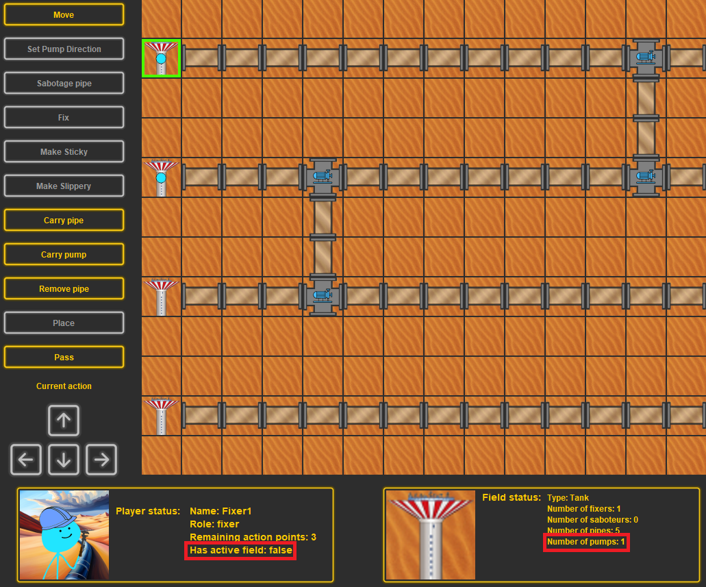

# Manuális tesztek dokumentálása

## 1. Teszt - Lépés
### Leírás: 
Move gomb megnyomása, majd a megfelelő (jelen esetben jobb) irány gomb megnyomása.
### Elvárt viselkedés:
Ennek hatására az aktív játékos egyet a kiválasztott irányba (jelen esetben jobbra) lép.
### Történt viselkedés:
Az elvárt viselkedés történt.

#### Lépés előtti kép

#### Lépés utáni kép

## 2. Teszt - Pumpa irány állítás
### Leírás: 
Set Pump Direction gomb megnyomása, majd a megfelelő (jelen esetben bal) irány gomb megnyomása a bemenő irány állítására és mégegyszer a megfelelő (jelen esetben jobb) irány gomb megnyomása a kimenő irány állítására.
### Elvárt viselkedés:
Ennek hatására a pumpa, amin az aktív játékos áll bemenő és kimenő iránya beállítódik (jelen esetben balról jobbra).
### Történt viselkedés:
Az elvárt viselkedés történt.

#### Pumpa állítás előtti kép

#### Pumpa állítás utáni kép

## 3. Teszt - Pumpa helyes működése
### Leírás: 
A pumpa be- és kimenete átállítódik.
### Elvárt viselkedés:
A pumpa csak az újonnan megadott irányból szívja a vizet és csak a megadott irányba továbbítja a vizet.
### Történt viselkedés:
Az elvárt viselkedés történt.

#### Pumpa helyes működése kép

## 4. Teszt - Cső szabotálás
### Leírás: 
Sabotage pipe gomb megnyomása.
### Elvárt viselkedés:
Ennek hatására a cső, amin az aktív játékos áll kilyukad, és nem folyik belőle tovább a víz.
### Történt viselkedés:
Az elvárt viselkedés történt.

#### Cső szabotálás előtti kép

#### Cső szabotálás utáni kép

## 5. Teszt - Cső javítás
### Leírás: 
Fix gomb megnyomása.
### Elvárt viselkedés:
Ennek hatására a cső, amin az aktív játékos áll megjavul, és megerősített hatású lesz pár körig.
### Történt viselkedés:
Az elvárt viselkedés történt.

#### Cső javítás előtti kép

#### Cső javítás utáni kép

## 6. Teszt - Pumpa javítás
### Leírás: 
Fix gomb megnyomása.
### Elvárt viselkedés:
Ennek hatására a pumpa, amin az aktív játékos áll megjavul, és a következő körben már tovább küldi a vizet.
### Történt viselkedés:
Az elvárt viselkedés történt.

#### Pumpa javítás előtti kép

#### Pumpa javítás utáni kép

## 7. Teszt - Megerősített cső szabotálása
### Leírás: 
Sabotage pipe gomb megnyomása olyan csövön, amelynek van megerősített hatása.
### Elvárt viselkedés:
Az ilyen csövet nem lehet kilyukasztani, tehát a Sabotage pipe gomb ilyen estben le van tiltva.
### Történt viselkedés:
Az elvárt viselkedés történt.

#### Megerősített cső szabotálása kép

## 8. Teszt - Ragadóssá tevés
### Leírás: 
Make sticky gomb megnyomása.
### Elvárt viselkedés:
Ennek hatására a cső, amin az aktív játékos áll ragadós hatású lesz, és más játékos nem léphet el róla pár körig.
### Történt viselkedés:
Az elvárt viselkedés történt.

#### Ragadóssá tevés előtti kép

#### Ragadóssá tevés utáni kép

## 9. Teszt - Beragadt játékos mozgása
### Leírás: 
Move gomb megnyomása olyan csövön, amelynek van ragadós hatása és nem az aktív játékos tette rá.
### Elvárt viselkedés:
Az ilyen csőröl a játékos nem mozoghat el, tehát a Move gomb ilyen esetben le van tiltva.
### Történt viselkedés:
Az elvárt viselkedés történt.

#### Beragadt játékos mozgása kép

## 10. Teszt - Csúszóssá tevés
### Leírás: 
Make slippery gomb megnyomása.
### Elvárt viselkedés:
Ennek hatására a cső, amin az aktív játékos áll csúszós hatású lesz, és ha valaki rálép, akkor ő átcsúszik egy szomszédos mezőre.
### Történt viselkedés:
Az elvárt viselkedés történt.

#### Csúszóssá tevés előtti kép

#### Csúszóssá tevés utáni kép

## 11. Teszt - Csúszós csőre lépés
### Leírás: 
Move gomb megnyomásával ha az aktív játékos egy csúszós csőre lép.
### Elvárt viselkedés:
Az ilyen csőre lépve az aktív játékos a szomszédos mezők valamelyikére kerül véletlenszerűen.
### Történt viselkedés:
Az elvárt viselkedés történt.

#### Csúszós csőre lépés előtti kép

#### Csúszós csőre lépés utáni kép

## 12. Teszt - Cső elvétele
### Leírás: 
Carry pipe gomb megnyomása.
### Elvárt viselkedés:
Ennek hatására az aktív játékosnál lesz egy cső, a ciszternában, amin áll, pedig eggyel kevesebb.
### Történt viselkedés:
Az elvárt viselkedés történt.

#### Cső elvétele előtti kép

#### Cső elvétele utáni kép

## 13. Teszt - Pumpa elvétele
### Leírás: 
Carry pump gomb megnyomása.
### Elvárt viselkedés:
Ennek hatására az aktív játékosnál lesz egy pumpa, a ciszternában, amin áll, pedig eggyel kevesebb.
### Történt viselkedés:
Az elvárt viselkedés történt.

#### Pumpa elvétele előtti kép

#### Pumpa elvétele utáni kép

## 14. Teszt - Lent lévő cső felvétele
### Leírás: 
Remove pipe gomb megnyomása, majd a megfelelő (jelen esetben jobb) irány gomb megnyomása.
### Elvárt viselkedés:
Ennek hatására az aktív játékosnál lesz egy cső (aktív elem), és a kiválasztott (jelen esetben jobb) irányból eltűnik a lent lévő.
### Történt viselkedés:
Az elvárt viselkedés történt.

#### Felvétel előtti kép
 

#### Felvétel utáni kép
 

## 15. Teszt - Cső lerakása
### Leírás: 
Place gomb megnyomása, majd a megfelelő (jelen esetben felfelé) irány gomb megnyomása.
### Elvárt viselkedés:
Ennek hatására az aktív játékosnál nem lesz aktív elem (jelen esetben cső), és a kiválasztott (jelen esetben felfelé) irányba pedig letevődik egy cső.
### Történt viselkedés:
Az elvárt viselkedés történt.

#### Lerakás előtti kép
 

#### Lerakás utáni kép
 

## 16. Teszt - Pumpa lerakása
### Leírás: 
Place gomb megnyomása, majd a megfelelő (jelen esetben jobb) irány gomb megnyomása.
### Elvárt viselkedés:
Ennek hatására az aktív játékosnál nem lesz aktív elem (jelen esetben pumpa), és a kiválasztott (jelen esetben jobb) irányba pedig letevődik egy pumpa.
### Történt viselkedés:
Az elvárt viselkedés történt.

#### Lerakás előtti kép
 

#### Lerakás utáni kép
 

## 17. Teszt - Passz
### Leírás: 
Pass gomb megnyomása.
### Elvárt viselkedés:
Ennek hatására az aktív játékos összes hátralévő akcióját elveszti, és a következő soron lévő játékos lesz az aktív játékos.
### Történt viselkedés:
Az elvárt viselkedés történt.

#### Passz előtti kép
 

#### Passz utáni kép
 

## 18. Teszt - Foglalalt csőre lépés
### Leírás: 
Move gomb megnyomásával az aktív játékos egy olyan csőre lép, amelyen éppen egy másik játékos áll.
### Elvárt viselkedés:
Az ilyen csőre a játékos nem léphet, tehát a Move gomb ilyen esetben le van tiltva az adott irányba.
### Történt viselkedés:
Az elvárt viselkedés történt.

 

## 19. Teszt - Ellenfelek találkozás
### Leírás: 
Move gomb megnyomásával az aktív játékos egy olyan pumpára lép, amelyen már egy ellenfél játékos áll.
### Elvárt viselkedés:
Az ilyen pumpán ilyen esetben látszódik, hogy egyszerre mindkét csapatból tartózkodik legalább egy-egy csapattag. Ezen kívül a Field statusban is látható, melyik csapatból hány játékos van éppen ott.
### Történt viselkedés:
Az elvárt viselkedés történt.

#### Lépés előtti kép
 

#### Lépés utáni kép

## 20. Teszt - Lyukas cső vízfolyás
### Leírás: 
Lyukas csőnél a kör végeztével kifolyik a víz a sivatagba.
### Elvárt viselkedés:
Egy lyukas cső nem szállítja/adja tovább a vizet a következő mezőnek, helyette megsemmisíti a benne lévő vizet és a szabotőrök pontszáma megnövekedik egyel.
### Történt viselkedés:
Az elvárt viselkedés történt.

#### Kifolyás előtti kép
 

#### Kifolyás utáni kép

## 21. Teszt - Ciszternába vízfolyás
### Leírás: 
Kör végén a ciszternába befolyik a víz.
### Elvárt viselkedés:
Egy ciszternába csatlakozó cső nem szállítja/adja tovább a vizet, helyette megsemmisíti a benne lévő vizet és a szerelők pontszáma megnövekedik egyel.
### Történt viselkedés:
Az elvárt viselkedés történt.

#### Ciszternába folyás előtti kép
 

#### Ciszternába folyás utáni kép

## 22. Teszt - Szabotőr győzelem
### Leírás: 
A szabotőrök nyertek.
### Elvárt viselkedés:
A szabotőrök pontszáma eléri a beállított győzelemhez kellő pontszámot, amivel a játéknak vége lesz és megjelenik a győzelmi felirat.
### Történt viselkedés:
Az elvárt viselkedés történt.

## 23. Teszt - Szerelő győzelem
### Leírás: 
A szerelők nyertek.
### Elvárt viselkedés:
A szerelők pontszáma eléri a beállított győzelemhez kellő pontszámot, amivel a játéknak vége lesz és megjelenik a győzelmi felirat.
### Történt viselkedés:
Az elvárt viselkedés történt.

## Összefoglalás

A szerintünk átfogó és részletes tesztek megírása után végre is hajtottuk őket, és mindegyikre az elvárt viselkedést kaptuk. A program ezek alapján helyesen funkcionálónak tűnik.

