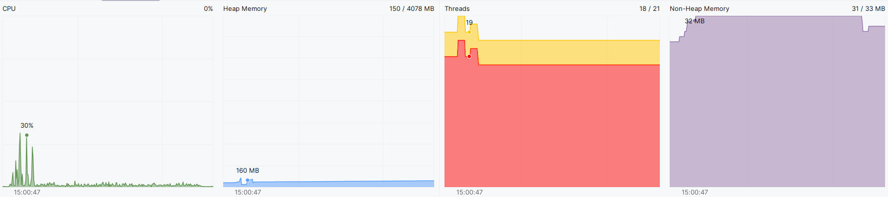

# Nem-funkcionális jellemzők vizsgálata

## Teljesítmény:

Az IntelliJ IDEA-ban beépített Profiler segítségével megvizsgáltuk a memória és a CPU kihasználtságát. Legfőbbképpen a CPU, a Heap Memory, a Threads és a Non-Heap Memory komponenseket elemeztük úgy, hogy a játékot 30 percen át futattuk, pontosabban egy új játék indítottunk és a játékot tétlenül magára hagytuk. Az egyes komponensek időbeli kihasználtságát egy-egy vonaldiagramban vannak ábrázolva:

**CPU**: 

A tétlen állapotban hagyott játék szinte nem igényelt sok CPU-t. A játék megnyitására szükség volt kb. 40%-nyi CPU , de az idő többi részében mindvégig 0% körül mozgott. A játék jól működik tétlen állapototban, hiszen emberi interakciók nélkül nem követel rengetteg CPU erőforrást. 

**Heap Memory**: 

A idle állapotú játék a kezdetben 121 MB-nyi memóriát fogalt, majd 20 perc elteltével 187 MB-ot foglalt azaz további 66 MB-ra volt szükség. 187 MB után a GC felszabadított 146 MB-ot, így 41 MB-nyi memórát foglalt összesen a program, amely után egy kis idő elteltével elkezdett újra nőni. A programban feltehetően nincs memóriaszivárgás és a GC a nem használt memóriákat felszabadítja.

**Threads**: 

A program futása során 18 szálat használ alapesetben az idők folyamán és maximálisan átlagosan 20 darab szál van engedélyezve. 

**Non-Heap Memory**: 

JVM és a  the Java runtime environment által használt objektumokat és struktúrákat a Non-Heap Memory tárolja. Jelen esetben 29 MB-ra volt szükség mindvégig.

## Stressz teszt:

A játék megnyitása után különböző felhasználói interakciókat próbáltunk ki, azaz egy automatikus egér kattintást megvalósító programmal (Automatic Mouse Clicker with Random & Fixed Location and Delay Interval) teszteltük, hogy felmérjük mennyire terheli a rendszert. 

Alapvetően 3 esetet definiáltunk:

- Pass gomb (a játékos kör vége gomb) megnyomása 3 másodpercenként folyamatosan

- Pass gomb (a játékos kör vége gomb) megnyomása másodpercenként legalább 10-szer folyamatosan

- Folyamatosan kiválasztunk egy random interakciót random kattingatásokkal

### Stressz teszt eredmények

**Pass gomb (a játékos körének vége gomb) megnyomása 3 másodpercenként folyamatosan**:

**CPU**: A pass gombok megnyomása során észrevettük, hogy amikor minden egyes játékkör véget ért akkor CPU-nak az erőforrásigénye jelentősen megugrik kb. 25%-ra. A csapatunk szerint az UI újratöltése és a ActionHandler osztályban lévő Wordturn függvény okozhatja ezt jelentős számítási megterhelést, mivel egymásba beágyazott ciklust használ és számítási igénye rendkívül magas. Illetve az játékosnak körének a befejezése után is megugrik a CPU kihasználtság, úgy 3%-ra

**Heap Memory**: Nem volt jelentős eltérés a tétlen játék állapotól. A memóriát mindig 200 Mb alatt tartotta.

**Threads**: Nem volt jelentős eltérés a tétlen játék állapotól

**Non-Heap Memory**: Nem volt jelentős eltérés a tétlen játék állapotól

**Pass gomb (a játékos körének vége gomb) megnyomása másodpercenként legalább 10-szer folyamatosan**:

**CPU**: A gyakori pass gombok megnyomása során gyakran végetér a játékosnak a köre és a CPU-nak az erőforrásigénye mindig kb. 20%-on volt. Mint korábban írtuk a 

**Heap Memory**: Nem volt jelentős eltérés a tétlen játék állapotól. A memóriát mindig 200 Mb alatt tartotta.

**Threads**: Nem volt jelentős eltérés a tétlen játék állapotól

**Non-Heap Memory**: Nem volt jelentős eltérés a tétlen játék állapotól

**Folyamatosan kiválasztunk egy random interakciót random kattingatásokkal**:

**CPU**: A gyakori random interakció gombok megnyomása során a játék egy hibára futott (bug-ra), ami után a játékos nem tudott további interakciót végrehajtani, és emiatt nem lehetett tovább játszani a játékot. A legnagyobb CPU igény az 30% körül mozgott és úgy 1 perc után a játéknak úgy 1-2%-nyi számításigénye volt szükség, ami az inaktív gombok megnyomása miatt kellett. Mivel a gombok megnyomása nem csináltak semmit, ezért nem kellett szinte semmit se kiszámolni a CPU-nak.

**Heap Memory**: Nem volt jelentős eltérés a tétlen játék állapotól. A memóriát mindig 200 Mb alatt tartotta.

**Threads**: Nem volt jelentős eltérés a tétlen játék állapotól

**Non-Heap Memory**: Nem volt jelentős eltérés a tétlen játék állapotól

### Biztonság

A játék biztonságos, nem tartalmaz számítógépre káros kódrészletet. A játék szoftver nem kér és nem táról érzékeny felhasználói adatokat. A játékot csak a gombok megnyomásával lehet játszani és input adatot csak a játék beállításánál lehet beadni, ahol jól vannak lekezelve a bekért adatok.

### Használhatóság

A játékban minden funkció megtalálható a jobboldalt és a lehetséges interakciókat és az információkat felhasználóbarát módon vannak feltűntve.

Azonban voltak problémák amelyek hiányosnak éreztük és kicsit zavarók is voltak:

- **Restart game funkció hiányossága**: Egy új játék indításához be kell zárni a játékot és újra el kell indítani a programot

- **Help ablak átláthatatlan**: A help dialógus ablak nem voltak annyira tagolva a szövegek, így nehéz volt átlátni őket és az információk feltűntetése se volt túl felhasználóbarát:

- **Hibák a játékban**: A játékban volt pár hiba, ami miatt leállt a játék és már semilyen akciót nem tudott végrehajtani a játékos (azaz jobboldalt nincs zöld határvonallal kiemelt gomb az UI-on és semelyik gomb se reagált):

### Összegzés

A játék nem-funkcionális jellemzőket megvizsgálva arra a következtetésre juttotunk, hogy a játékban nincs memóriaszívárgás és a CPU-t csak akkor használja, ha ténylegesen használjuk a szoftvert. Megnéztük, hogy mennyire bírja a terhelést és mely funckió igényel jelentős erőforrást. Ellenőriztük azt is, hogy legfejebb mennyi memóriára lehet szükség a futtatáshoz. A biztonsági aspektustba is belenéztünk, ahol nem kér a felhasználótól szenzitív adatot, illetve a bekért adatok nem törik meg a kódott. A játék használhatóság szempontjából voltak némi tovább fejlesztendő dolgok, amely a játékélményt feljavíthatná és minőségibb szoftvertté tenné. Voltak hibák is a játékban, amit a játék fejlesztése során még nem derült ki, ezért a tesztelés valóban segít a problémák feltárásában és időben ki tudjuk javítani a hibákat még mielőtt a felhasználóhoz kerül a játék.

